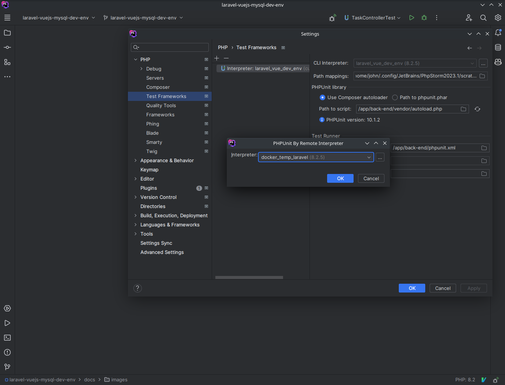

# Running the services

---

* in the root dir, run:   `docker-compose up`

# Initial setup

---

## Entering the App's shell environment
* in any dir of the project, run:  `bash ./path/to/scripts/enterAppShell.sh`
    
      For example, in the root dir, run: ./scripts/enterAppShell.sh

## Installing dependencies
Enter the app's shell as explained above.
* **front-end** dependencies: `cd /app/front-end` then `npm install`
* **back-end** dependencies: `cd /app/back-end` then `composer install`

# DB Setup

---

* login to adminer at `http://localhost:8080/`

        System: MySQL
        Database: todo_app
        Username: laravel_user
        Password: laravel_password

* click on **execute sql statement**, and paste the contents of **setup.sql** found in **./app/database**

* Execute the following command to generate models from the database if needed: 

        bash ./scripts/generateModels.sh

# Running the app 

---

* Execute the serveProd.sh script. Eg: in root dir `bash ./scripts/serveProd.sh`

# Running in dev mode

---

All the scripts below can be found in the **scripts** dir. They can be executed from the projects root dir or any sub dir.
Eg, in root dir: `bash ./scripts/generateModels`

* To serve the front-end with hot reloading, execute `serveFrontEnd.sh`
* To serve the back-end, execute `serveBackEnd.sh`

# Testing

---
Testing is currently only setup for the back-end and can be run by executing two scripts:
* **Unit tests**: `runUnitTests.sh`
* **Feature tests**: `runFeatureTests.sh`

# PhpStorm setup

---

## Setup php interpreter
To make phpstorm use the cli interpreter of the app container we can do the following:

* Enter settings and click on PHP, then click on the 3 dots next to the CLI interpreter dropdown:
  
* Click on the plus sign to add a new interpreter and choose "From Docker, Vagrant, VM, Remote...":
  
* Choose "Docker Compose" and click on "New" next to the "Server" field. Give it a name and click "OK":
  
* In the services dropdown, choose the **app** service and click "OK":
  

## Setup PHPUnit testing
Testing and debugging can be done from within phpstorm. To do this we need to setup the phpunit configuration:

* In the settings page under PHP, click on "Test Frameworks" and click on the plus sign to add a new framework. Choose "PHPUnit by Remote Interpreter" and click "OK":
  
* Select the interpreter we setup above and click "OK":
  
* Next set the path to the composer autoload file. This is the file that is generated when running `composer install`. Copy the path in the image below and make sure to click on the refresh button to the right of the path field to ensure the path is correct:
  
* Next set the path to the phpunit.xml file. This is the file that is generated when running `composer install`. Tick the "Default configuration file" checkbox and copy the path in the image below. Click "OK":
  

This testing setup can be used when running tests from within phpstorm.